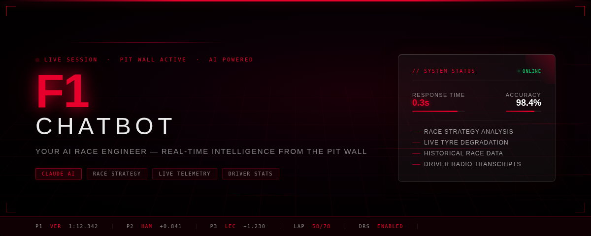
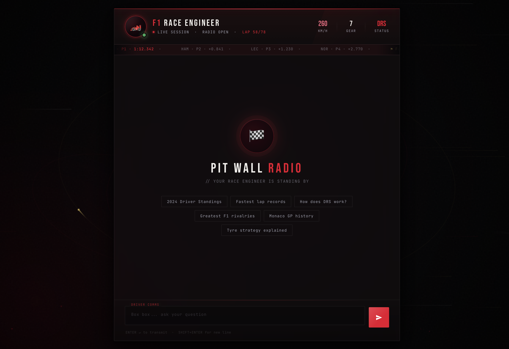
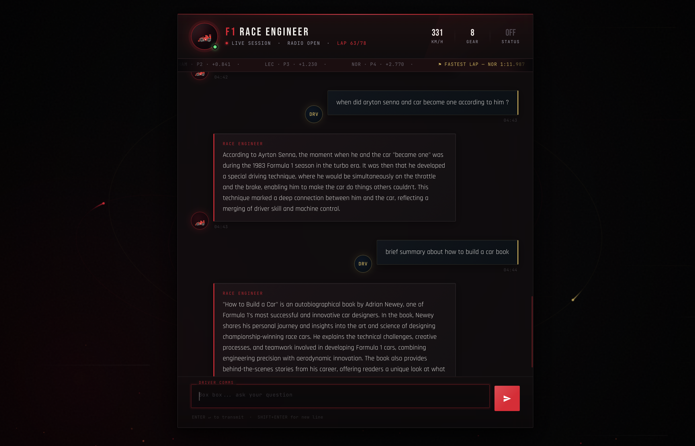
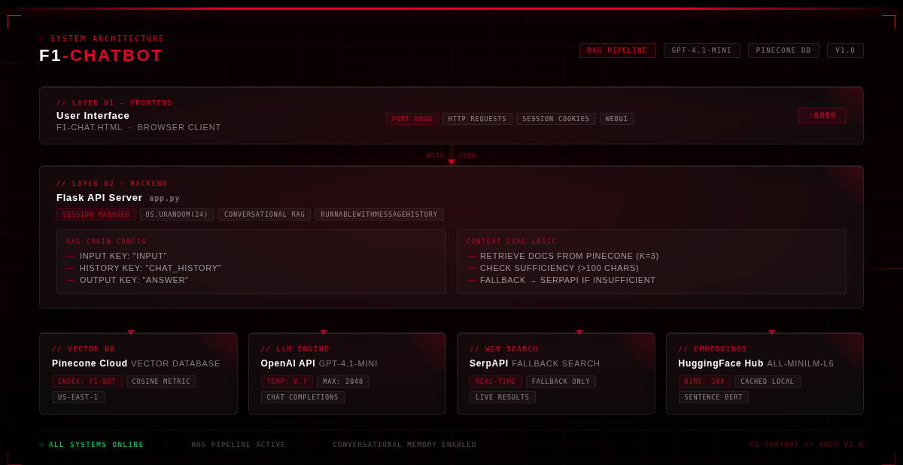
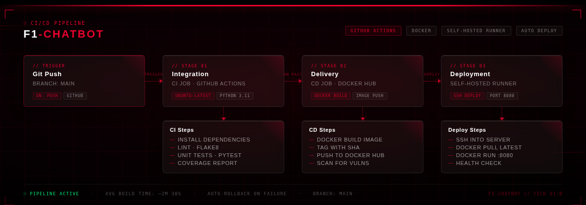

<h1> 🏎️ Formula 1 AI Chatbot - Production RAG System </h1>



---

## 🎯 Project Overview

The **Formula 1 AI Chatbot** is a production-ready, cloud-native conversational AI system that combines historical F1 data with real-time web search to deliver expert-level insights. Built with modern MLOps/DevOps practices, this platform demonstrates enterprise-level architecture patterns including automated CI/CD pipelines, containerized deployment, and intelligent context management.

### Why This Matters

This project showcases a complete MLOps lifecycle from data ingestion to production deployment, featuring:

- Hybrid retrieval strategies that balance local knowledge with real-time information
- Stateful conversation management for multi-turn interactions
- Production-grade containerization with optimized dependencies
- Fully automated CI/CD pipeline with self-hosted deployment

### ✨ Key Features

- **Hybrid RAG Architecture**: Combines Pinecone vector database (k=3 similarity search) with SerpAPI web search fallback when context is insufficient
- **Conversational Memory**: Session-based chat history using LangChain's `RunnableWithMessageHistory` with in-memory storage
- **Multi-Format Data Ingestion**: Unified pipeline for PDF documents and CSV files with latin-1 encoding support
- **Intelligent Context Evaluation**: Dynamic threshold-based switching (100 char minimum) between RAG and web search
- **Optimized Embeddings**: HuggingFace sentence-transformers (all-MiniLM-L6-v2) with 384-dimensional vectors and local caching
- **Production Docker Build**: CPU-optimized PyTorch (2.2.0+cpu) with minimal dependencies and libgomp1 for parallel processing
- **Automated CI/CD**: Three-stage GitHub Actions pipeline (Integration → Delivery → Deployment) with Docker Hub registry
- **Self-Hosted Deployment**: Automated container orchestration on self-hosted runners with health checks and cleanup

### Project Photos



## 

## 🏗️ System Architecture

### Architecture Diagram



<!-- Add your architecture diagram here -->

```
┌─────────────────────────────────────────────────────────────────┐
│                         User Interface                          │
│                    (f1-chat.html - Port 8080)                   │
└────────────────────────────┬────────────────────────────────────┘
                             │
                             ▼
┌─────────────────────────────────────────────────────────────────┐
│                    Flask API Server (app.py)                    │
│  ┌──────────────────────────────────────────────────────────┐   │
│  │  Session Management (Flask Sessions + os.urandom(24))    │   │
│  └──────────────────────────────────────────────────────────┘   │
│  ┌──────────────────────────────────────────────────────────┐   │
│  │  Conversational RAG Chain (RunnableWithMessageHistory)   │   │
│  │  • Input Messages Key: "input"                           │   │
│  │  • History Messages Key: "chat_history"                  │   │
│  │  • Output Messages Key: "answer"                         │   │
│  └──────────────────────────────────────────────────────────┘   │
│  ┌──────────────────────────────────────────────────────────┐   │
│  │  Context Evaluation Logic                                │   │
│  │  1. Retrieve docs from Pinecone (k=3)                    │   │
│  │  2. Check context sufficiency (>100 chars)               │   │
│  │  3. Fallback to SerpAPI if insufficient                  │   │
│  └──────────────────────────────────────────────────────────┘   │
└─────────────────────────────────────────────────────────────────┘
                             │
         ┌───────────────────┼───────────────────┬─────────────────┐
         ▼                   ▼                   ▼                 ▼
┌──────────────────┐ ┌──────────────┐ ┌──────────────┐ ┌──────────────────┐
│  Pinecone Cloud  │ │  OpenAI API  │ │   SerpAPI    │ │  HuggingFace Hub │
│  Vector Database │ │  GPT-4.1-mini│ │  Web Search  │ │   Embeddings     │
│                  │ │              │ │   Fallback   │ │  (all-MiniLM-L6) │
│ • Index: f1-bot  │ │ • Temp: 0.7  │ │ • Real-time  │ │ • Dims: 384      │
│ • Metric: cosine │ │ • Max: 2048  │ │ • Fallback   │ │ • Cached locally │
│ • Region: us-e-1 │ │              │ │              │ │                  │
└──────────────────┘ └──────────────┘ └──────────────┘ └──────────────────┘
```

### Technology Stack

| Component               | Technology                     | Version    | Purpose                                           |
| ----------------------- | ------------------------------ | ---------- | ------------------------------------------------- |
| **API Framework**       | Flask                          | 3.1.1      | REST API server and web interface                 |
| **LLM Orchestration**   | LangChain                      | 0.3.26     | RAG pipeline, chains, and conversation management |
| **Language Model**      | OpenAI GPT-4.1-mini            | Latest     | Natural language generation and reasoning         |
| **Vector Database**     | Pinecone                       | Serverless | Semantic search with cosine similarity            |
| **Embeddings**          | HuggingFace Transformers       | 4.1.0      | sentence-transformers/all-MiniLM-L6-v2 (384-dim)  |
| **Web Search**          | SerpAPI                        | Latest     | Real-time web search fallback mechanism           |
| **ML Framework**        | PyTorch                        | 2.2.0+cpu  | CPU-optimized tensor operations                   |
| **Document Processing** | PyPDF + CSVLoader              | 5.6.1      | Multi-format data ingestion                       |
| **Text Splitting**      | RecursiveCharacterTextSplitter | -          | Chunk size: 500, overlap: 20                      |
| **Containerization**    | Docker                         | Latest     | Multi-stage builds with Debian Bookworm           |
| **CI/CD**               | GitHub Actions                 | -          | Automated testing, building, and deployment       |
| **Container Registry**  | Docker Hub                     | -          | Image storage and distribution                    |
| **Deployment**          | Self-Hosted Runner             | -          | Production container orchestration                |
| **Configuration**       | python-dotenv                  | 1.1.0      | Environment variable management                   |

### Component Interaction Flow

1. **User Query** → Flask API receives POST request at `/get` endpoint
2. **Session Management** → Retrieves or creates session ID using `os.urandom(16).hex()`
3. **Vector Retrieval** → Queries Pinecone with embedded user input (top-k=3)
4. **Context Evaluation** → Checks if retrieved docs contain >100 characters
5. **Hybrid Search Decision**:
   - **Sufficient Context**: Uses RAG chain with retrieved documents
   - **Insufficient Context**: Appends SerpAPI web search results to user input
6. **Conversational Chain** → Invokes `RunnableWithMessageHistory` with session context
7. **LLM Generation** → GPT-4.1-mini generates response using context + chat history
8. **Response Delivery** → Returns answer string to frontend

---

## 🚀 CI/CD Pipeline

### Pipeline Diagram



<!-- Add your CI/CD pipeline diagram here -->

```
┌──────────────┐     ┌──────────────┐     ┌──────────────────┐     ┌──────────────┐
│   Git Push   │────▶│  Integration │────▶│    Delivery      │────▶│  Deployment  │
│   to main    │     │   (CI Job)   │     │   (CD Job)       │     │  (Self-Host) │
└──────────────┘     └──────────────┘     └──────────────────┘     └──────────────┘
                            │                      │                        │
                            ▼                      ▼                        ▼
                     ┌──────────┐          ┌──────────┐            ┌──────────┐
                     │  Lint    │          │  Build   │            │  Pull    │
                     │  Test    │          │  Push    │            │  Run     │
                     └──────────┘          └──────────┘            └──────────┘
```

### Workflow Stages

#### 🔍 Stage 1: Continuous Integration

- **Trigger**: Push to `main` branch (excludes README.md changes)
- **Runner**: `ubuntu-latest` (GitHub-hosted)
- **Actions**:
  - Code checkout from repository
  - Linting validation (placeholder for flake8/ruff)
  - Unit test execution (placeholder for pytest)
- **Purpose**: Validate code quality and functionality before building artifacts

#### 📦 Stage 2: Continuous Delivery

- **Trigger**: Successful completion of Integration stage
- **Runner**: `ubuntu-latest` (GitHub-hosted)
- **Actions**:
  - Install system utilities (jq, unzip)
  - Authenticate to Docker Hub using secrets
  - Set up Docker Buildx for multi-platform builds
  - Build Docker image from Dockerfile
  - Tag image as `{DOCKERHUB_USERNAME}/f1-chatbot:latest`
  - Push image to Docker Hub registry
- **Purpose**: Create and publish production-ready container artifacts

#### 🚀 Stage 3: Continuous Deployment

- **Trigger**: Successful image push to Docker Hub
- **Runner**: `self-hosted` (your infrastructure)
- **Actions**:
  - Authenticate to Docker Hub
  - Stop and remove existing `f1-chatbot` container
  - Prune old images (>24h) to free disk space
  - Pull latest image from Docker Hub
  - Run new container with environment variables:
    - `AWS_ACCESS_KEY_ID`, `AWS_SECRET_ACCESS_KEY`, `AWS_DEFAULT_REGION`
    - `PINECONE_API_KEY`, `OPENAI_API_KEY`, `SERPAPI_API_KEY`
  - Expose port 8080
  - Clean up unused Docker resources
- **Purpose**: Zero-downtime deployment to production environment

### CI/CD Configuration Summary

```yaml
Trigger: push to main (excluding README.md)
Permissions: id-token:write, contents:read
Jobs: 3 (integration → build-and-push-images → Continuous-Deployment)
Registry: Docker Hub
Image Tag: {DOCKERHUB_USERNAME}/f1-chatbot:latest
Deployment: Self-hosted runner with automated rollout
```

---

## 🐳 Docker Deployment

### Dockerfile Configuration

```dockerfile
# Base Image: Python 3.11 on Debian Bookworm (slim variant)
FROM python:3.11-slim-bookworm

# Working Directory
WORKDIR /app

# Copy Application Code
COPY . /app

# Install System Dependencies
# libgomp1: Required for PyTorch CPU parallel processing
RUN apt-get update && apt-get install -y --no-install-recommends \
    libgomp1 \
    && rm -rf /var/lib/apt/lists/*

# Install Python Dependencies
# --no-cache-dir: Reduces image size by not caching pip packages
RUN pip install --no-cache-dir --upgrade pip && \
    pip install --no-cache-dir -r requirements.txt

# Expose Application Port
EXPOSE 8080

# Container Entrypoint
CMD ["python3", "Flask_api/app.py"]
```

### Build & Run Commands

```bash
# Build Docker image
docker build -t f1-chatbot:latest .

# Run container with environment variables
docker run -d \
  -p 8080:8080 \
  --name f1-chatbot \
  -e PINECONE_API_KEY=${PINECONE_API_KEY} \
  -e OPENAI_API_KEY=${OPENAI_API_KEY} \
  -e SERPAPI_API_KEY=${SERPAPI_API_KEY} \
  -e AWS_ACCESS_KEY_ID=${AWS_ACCESS_KEY_ID} \
  -e AWS_SECRET_ACCESS_KEY=${AWS_SECRET_ACCESS_KEY} \
  -e AWS_DEFAULT_REGION=${AWS_DEFAULT_REGION} \
  --restart unless-stopped \
  f1-chatbot:latest

# View logs
docker logs -f f1-chatbot

# Stop container
docker stop f1-chatbot

# Remove container
docker rm f1-chatbot
```

---

## 🌐 API Endpoints

### Endpoint Specification

| Endpoint | Method | Content-Type                      | Description                                 | Authentication |
| -------- | ------ | --------------------------------- | ------------------------------------------- | -------------- |
| `/`      | GET    | text/html                         | Serves chat interface, initializes session  | None           |
| `/get`   | POST   | application/x-www-form-urlencoded | Processes chat message, returns AI response | Session-based  |

### API Usage Examples

#### Chat Endpoint

```bash
# Example 1: Query about championship
curl -X POST http://localhost:8080/get \
  -H "Content-Type: application/x-www-form-urlencoded" \
  -d "msg=Who won the 2023 F1 World Championship?" \
  -c cookies.txt \
  -b cookies.txt

# Response (plain text):
"Max Verstappen won the 2023 Formula 1 World Championship with Red Bull Racing..."

# Example 2: Circuit information
curl -X POST http://localhost:8080/get \
  -H "Content-Type: application/x-www-form-urlencoded" \
  -d "msg=Tell me about the Monaco Grand Prix circuit" \
  -c cookies.txt \
  -b cookies.txt

# Response:
"The Monaco Grand Prix is held on the Circuit de Monaco, a street circuit..."
```

---

## 📁 Project Structure

```
formula-1-chatbot/
│
├── .github/
│   └── workflows/
│       └── cicd.yaml              # GitHub Actions CI/CD pipeline
│
├── Flask_api/
│   └── app.py                     # Main Flask application server
│
├── src/
│   ├── __init__.py                # Package initialization
│   ├── helper.py                  # Data loading, chunking, embeddings
│   └── prompt.py                  # System prompts and templates
│
├── data/                          # F1 dataset (not in version control)
│   ├── circuits.csv               # Circuit information
│   ├── constructors.csv           # Team/constructor data
│   ├── drivers.csv                # Driver statistics
│   ├── races.csv                  # Race history
│   ├── results.csv                # Race results
│   ├── qualifying.csv             # Qualifying session data
│   ├── driver_standings.csv       # Championship standings
│   ├── constructor_standings.csv  # Constructor championship
│   ├── f1_2025_last_race_results.csv
│   └── *.pdf                      # F1 reference documents
│
├── templates/
│   └── f1-chat.html               # Web chat interface
│
├── formula_1_chatbot.egg-info/    # Package metadata (auto-generated)
│
├── .env                           # Environment variables (not in repo)
├── .gitignore                     # Git ignore rules
├── Dockerfile                     # Container build configuration
├── requirements.txt               # Python dependencies with PyTorch CPU
├── setup.py                       # Package setup configuration
├── store_index.py                 # Vector DB indexing script (run once)
└── README.md                      # This file
```

---

## 🚀 Getting Started

### Prerequisites

- **Python**: 3.11
- **Docker**: 20.10+ (optional, for containerized deployment)
- **Git**: For version control
- **API Keys** (required):
  - OpenAI API Key ([Get here](https://platform.openai.com/api-keys))
  - Pinecone API Key ([Get here](https://www.pinecone.io/))
  - SerpAPI Key ([Get here](https://serpapi.com/))
- **AWS Credentials** (optional, for cloud deployment):
  - AWS Access Key ID
  - AWS Secret Access Key

### Local Development Setup

#### Step 1: Clone Repository

```bash
git clone https://github.com/yourusername/formula-1-chatbot.git
cd formula-1-chatbot
```

#### Step 2: Create Virtual Environment

```bash
# Create virtual environment
python3.11 -m venv .venv

# Activate virtual environment
source .venv/bin/activate  # macOS/Linux
# .venv\Scripts\activate   # Windows
```

#### Step 3: Install Dependencies

```bash
# Upgrade pip
pip install --upgrade pip

# Install project dependencies
pip install -r requirements.txt

# Verify installation
pip list | grep -E "langchain|flask|pinecone"
```

#### Step 4: Configure Environment Variables

```bash
# Create .env file
cat > .env << EOF
# OpenAI Configuration
OPENAI_API_KEY=sk-proj-xxxxxxxxxxxxxxxxxxxxx

# Pinecone Configuration
PINECONE_API_KEY=xxxxxxxx-xxxx-xxxx-xxxx-xxxxxxxxxxxx

# SerpAPI Configuration
SERPAPI_API_KEY=xxxxxxxxxxxxxxxxxxxxxxxxxxxxxxxx

# AWS Configuration (optional)
AWS_ACCESS_KEY_ID=AKIAxxxxxxxxxxxxxxxxx
AWS_SECRET_ACCESS_KEY=xxxxxxxxxxxxxxxxxxxxxxxxxxxxxxxxxxxxxxxx
AWS_DEFAULT_REGION=us-east-1
EOF

# Secure the file
chmod 600 .env
```

#### Step 5: Initialize Vector Database

```bash
# Run indexing script (one-time setup)
python store_index.py

# Expected output:
# Loading documents from data/...
# Splitting text into chunks...
# Creating Pinecone index: formula-1-chatbot
# Uploading embeddings...
# ✓ Index created successfully
```

#### Step 6: Start Application

```bash
# Run Flask development server
python Flask_api/app.py

# Expected output:
# * Serving Flask app 'app'
# * Debug mode: on
# * Running on http://0.0.0.0:8080
```

#### Step 7: Access Application

```bash
# Open browser
open http://localhost:8080

# Or test with curl
curl -X POST http://localhost:8080/get \
  -d "msg=Who is the current F1 champion?"
```

### Docker Deployment

```bash
# Build image
docker build -t f1-chatbot:latest .

# Run container
docker run -d \
  -p 8080:8080 \
  --name f1-chatbot \
  --env-file .env \
  --restart unless-stopped \
  f1-chatbot:latest

# Check logs
docker logs -f f1-chatbot

# Health check
curl http://localhost:8080/
```

---

## ☁️ Cloud Infrastructure

### AWS Deployment Architecture

```
┌─────────────────────────────────────────────────────────────┐
│                    Internet Gateway                         │
└────────────────────────┬────────────────────────────────────┘
                         │
                         ▼
┌─────────────────────────────────────────────────────────────┐
│              Application Load Balancer (ALB)                │
│              - Health checks: /                             │
│              - Target: EC2 instance port 8080               │
└────────────────────────┬────────────────────────────────────┘
                         │
                         ▼
┌─────────────────────────────────────────────────────────────┐
│         EC2 Instance (Self-Hosted GitHub Runner)            │
│         - Type: t3.medium (2 vCPU, 4 GB RAM)                │
│         - OS: Ubuntu 22.04 LTS                              │
│         - Docker Engine: 24.0+                              │
│         - Security Group: f1-chatbot-sg                     │
│                                                             │
│   ┌─────────────────────────────────────────────────┐       │
│   │  Docker Container: f1-chatbot:latest            │       │
│   │  - Port: 8080                                   │       │
│   │  - Restart: unless-stopped                      │       │
│   │  - Env: Secrets from GitHub Actions             │       │
│   └─────────────────────────────────────────────────┘       │
└─────────────────────────────────────────────────────────────┘
                         │
         ┌───────────────┼───────────────┬─────────────────┐
         ▼               ▼               ▼                 ▼
┌──────────────┐ ┌──────────────┐ ┌──────────────┐ ┌──────────────┐
│  Pinecone    │ │  OpenAI API  │ │   SerpAPI    │ │ Docker Hub   │
│  (us-east-1) │ │              │ │              │ │  Registry    │
└──────────────┘ └──────────────┘ └──────────────┘ └──────────────┘
```

### EC2 Instance Configuration

```bash
# Instance specifications
Instance Type: t3.medium
vCPUs: 2
Memory: 4 GB
Storage: 30 GB gp3 SSD
OS: Ubuntu 22.04 LTS
Region: us-east-1

# Security Group Rules
Inbound:
  - Port 8080 (HTTP) from 0.0.0.0/0
  - Port 22 (SSH) from your-ip/32
  - Port 443 (HTTPS) from 0.0.0.0/0 (if using SSL)

Outbound:
  - All traffic to 0.0.0.0/0
```

### EC2 Setup Commands

```bash
# 1. Launch EC2 instance
aws ec2 run-instances \
  --image-id ami-0c55b159cbfafe1f0 \
  --instance-type t3.medium \
  --key-name your-key-pair \
  --security-group-ids sg-xxxxxxxxx \
  --subnet-id subnet-xxxxxxxxx \
  --tag-specifications 'ResourceType=instance,Tags=[{Key=Name,Value=f1-chatbot-prod}]'

# 2. SSH into instance
ssh -i your-key.pem ubuntu@ec2-xx-xx-xx-xx.compute-1.amazonaws.com

# 3. Install Docker
sudo apt-get update
sudo apt-get install -y docker.io docker-compose
sudo systemctl start docker
sudo systemctl enable docker
sudo usermod -aG docker ubuntu

# 4. Install GitHub Actions Runner
mkdir actions-runner && cd actions-runner
curl -o actions-runner-linux-x64-2.311.0.tar.gz -L \
  https://github.com/actions/runner/releases/download/v2.311.0/actions-runner-linux-x64-2.311.0.tar.gz
tar xzf ./actions-runner-linux-x64-2.311.0.tar.gz
./config.sh --url https://github.com/yourusername/formula-1-chatbot --token YOUR_TOKEN
sudo ./svc.sh install
sudo ./svc.sh start
```

---

## 🔐 Security & Configuration

### Environment Variables

| Variable                | Required | Description                         | Example                                    |
| ----------------------- | -------- | ----------------------------------- | ------------------------------------------ |
| `PINECONE_API_KEY`      | Yes      | Pinecone vector database API key    | `xxxxxxxx-xxxx-xxxx-xxxx-xxxxxxxxxxxx`     |
| `OPENAI_API_KEY`        | Yes      | OpenAI API key for GPT-4.1-mini     | `sk-proj-xxxxxxxxxxxxxxxxxxxxx`            |
| `SERPAPI_API_KEY`       | Yes      | SerpAPI key for web search fallback | `xxxxxxxxxxxxxxxxxxxxxxxxxxxxxxxx`         |
| `AWS_ACCESS_KEY_ID`     | No       | AWS credentials for S3/CloudWatch   | `AKIAxxxxxxxxxxxxxxxxx`                    |
| `AWS_SECRET_ACCESS_KEY` | No       | AWS secret key                      | `xxxxxxxxxxxxxxxxxxxxxxxxxxxxxxxxxxxxxxxx` |
| `AWS_DEFAULT_REGION`    | No       | AWS region                          | `us-east-1`                                |

#### GitHub Actions Secrets

```bash
# Navigate to: Repository > Settings > Secrets and variables > Actions

# Required Secrets:
DOCKERHUB_TOKEN          # Docker Hub access token
PINECONE_API_KEY         # Pinecone API key
OPENAI_API_KEY           # OpenAI API key
SERPAPI_API_KEY          # SerpAPI key
AWS_ACCESS_KEY_ID        # AWS access key
AWS_SECRET_ACCESS_KEY    # AWS secret key
AWS_REGION               # AWS region

# Required Variables:
DOCKERHUB_USERNAME       # Docker Hub username
```

---

---

## 📊 Data Pipeline Details

### Data Ingestion Flow

```
Raw Data Sources
       │
       ├─── PDFs (Technical Documents)
       │     └─── PyPDFLoader
       │           └─── Page-by-page extraction
       │
       └─── CSVs (Race Data)
             └─── CSVLoader (encoding: latin-1)
                   └─── Row-by-row parsing
                         │
                         ▼
                   Combined Documents
                         │
                         ▼
                   Metadata Filtering
                   (keep only 'source')
                         │
                         ▼
                   Text Chunking
                   (500 chars, 20 overlap)
                         │
                         ▼
                   Embedding Generation
                   (384-dim vectors)
                         │
                         ▼
                   Pinecone Upload
                   (batch upsert)
```

### Data Files Overview

| File                            | Records  | Description                                      | Size     |
| ------------------------------- | -------- | ------------------------------------------------ | -------- |
| `circuits.csv`                  | ~77      | F1 circuit information (name, location, country) | ~8 KB    |
| `constructors.csv`              | ~211     | Constructor/team data (name, nationality)        | ~12 KB   |
| `drivers.csv`                   | ~857     | Driver information (name, DOB, nationality)      | ~45 KB   |
| `races.csv`                     | ~1,100   | Race history (year, round, circuit, date)        | ~85 KB   |
| `results.csv`                   | ~26,000  | Race results (position, points, status)          | ~2.5 MB  |
| `qualifying.csv`                | ~10,000  | Qualifying session data                          | ~850 KB  |
| `driver_standings.csv`          | ~34,000  | Championship standings by race                   | ~1.8 MB  |
| `constructor_standings.csv`     | ~13,000  | Constructor championship data                    | ~650 KB  |
| `f1_2025_last_race_results.csv` | ~20      | Latest 2025 race results                         | ~2 KB    |
| `*.pdf`                         | Variable | F1 technical documents and books                 | Variable |

```

---

## 👤 Author

**Aswin Shine**

- 📧 Email: ashwinsh.91@gmail.com
- 🐙 GitHub: [@yourusername](https://github.com/yourusername)
- 💼 LinkedIn: [Aswin Shine](https://linkedin.com/in/yourprofile)
---

## 🙏 Acknowledgments

This project leverages world-class open-source and commercial technologies:

- **LangChain** - For the powerful RAG orchestration framework
- **OpenAI** - For GPT-4.1-mini language model
- **Pinecone** - For serverless vector database infrastructure
- **HuggingFace** - For open-source sentence-transformers embeddings
- **SerpAPI** - For real-time web search capabilities
- **Flask** - For lightweight and flexible web framework
- **Docker** - For containerization and deployment consistency
- **GitHub Actions** - For automated CI/CD pipelines
- **Formula 1** - For the incredible sport that inspired this project
- **Ergast API** - For historical F1 data

---

## 📞 Contact & Support

### Getting Help

- **Issues**: [GitHub Issues](https://github.com/yourusername/formula-1-chatbot/issues)
- **Discussions**: [GitHub Discussions](https://github.com/yourusername/formula-1-chatbot/discussions)
- **Email**: ashwinsh.91@gmail.com

### Contributing

Contributions are welcome! Please follow these steps:

1. Fork the repository
2. Create a feature branch (`git checkout -b feature/amazing-feature`)
3. Commit your changes (`git commit -m 'Add amazing feature'`)
4. Push to the branch (`git push origin feature/amazing-feature`)
5. Open a Pull Request

### Code of Conduct

Please be respectful and constructive in all interactions. This project follows the [Contributor Covenant Code of Conduct](https://www.contributor-covenant.org/).

---

## 📄 License

This project is licensed under the MIT License - see the [LICENSE](LICENSE) file for details.

```

MIT License

Copyright (c) 2025 Aswin Shine

Permission is hereby granted, free of charge, to any person obtaining a copy
of this software and associated documentation files (the "Software"), to deal
in the Software without restriction, including without limitation the rights
to use, copy, modify, merge, publish, distribute, sublicense, and/or sell
copies of the Software, and to permit persons to whom the Software is
furnished to do so, subject to the following conditions:

The above copyright notice and this permission notice shall be included in all
copies or substantial portions of the Software.

---

## 🎓 Learning Resources

### Understanding RAG Architecture

- [LangChain RAG Documentation](https://python.langchain.com/docs/use_cases/question_answering/)
- [Pinecone Vector Database Guide](https://docs.pinecone.io/)
- [OpenAI API Best Practices](https://platform.openai.com/docs/guides/production-best-practices)

### MLOps Best Practices

- [Google MLOps Whitepaper](https://cloud.google.com/architecture/mlops-continuous-delivery-and-automation-pipelines-in-machine-learning)
- [Docker Best Practices](https://docs.docker.com/develop/dev-best-practices/)
- [GitHub Actions Documentation](https://docs.github.com/en/actions)

---

<div align="center">

### ⭐ Star this repository if you find it helpful!

**Built with ❤️ using MLOps best practices**

</div>
